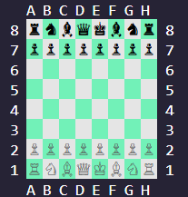

# Parancssoros Sakkjáték (CLI Chess) ♟️

Egy C++ nyelven, objektumorientált paradigmákkal megvalósított parancssoros sakkjáték. A program nem csak a hagyományos sakk szabályait ismeri és tartatja be, de képes szabványos PGN (Portable Game Notation) fájlok beolvasására, lejátszására és generálására is.

## 🌟 Főbb funkciók

* **Teljes körű sakkszabályzat:** Támogatja a speciális lépéseket is (en passant, sáncolás, gyalogátváltozás).
* **Játékállapot felügyelete:** Sakk, matt, patt, 50 lépéses szabály és 3 lépéses ismétlés felismerése.
* **PGN Támogatás:** * Korábbi (pl. chess.com, lichess.org) PGN fájlok beolvasása és visszajátszása (oda-vissza léptetéssel).
* Lejátszott vagy félbeszakított mérkőzések exportálása PGN formátumba.

## 🖼️ Előnézet

* A játék úgy lett megcsinálva CLI-n belül, hogy az a chess.com alapértelmezett felületére hasonlítson.
* 

## 🚀 Telepítés és Futtatás

* **Előfeltételek:**
* C++14 fordító (pl. GCC, Clang)
* Make (opcionális, ha Makefile-t használsz)

**Fordítás:**

* Parancssorból:

```bash
g++ -o chess src/main.cpp src/[egyéb .cpp fájlok]
```

* **Futtatás:**

A játék indítása normál módban:

```bash
./chess
```

* PGN fájl betöltése visszajátszáshoz:

```bash
./chess --pgn [fájl_elérési_útja.pgn]
```

* Make használatával:
* **Fordítás:**

  ```bash
  make
  ```

* **Object fájlok törlése:**

  ```bash
  make clean
  ```

## 📖 Fejlesztői Dokumentáció

Ha érdekel a program belső felépítése (osztálydiagramok, algoritmusok, és a `Piece` ősosztály logikája), kérlek olvasd el a részletes [Feladatspecifikációt és Tervezetet](docs/Feladatspecifikacio.pdf).

## 👨‍💻 Készítette

* **Balogh Tamás** - *Programozás alapjai II. Nagyházi*
